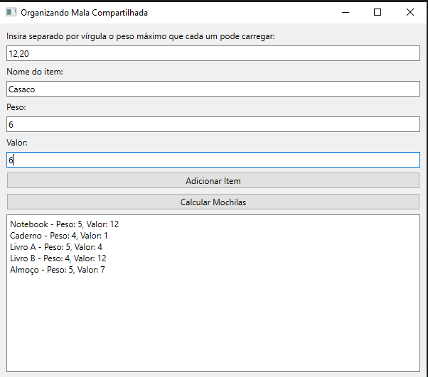
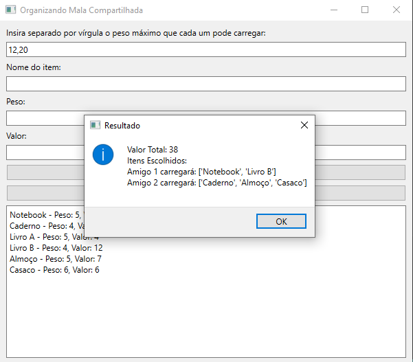

# PD_MochilaViagemComAmigos

**Conteúdo da Disciplina**: Programação Dinâmica<br>

## Alunos
|Matrícula | Aluno |
| -- | -- |
| 20/0043030  |  Renann de Oliveira Gomes |

## Sobre 
Projeto para auxiliar na distruição de itens em várias mochilas, pensando sempre em obter o maior valor "Valor" possível </br>

[Apresentação do projeto](https://youtu.be/MHkMjcLNVb8) 

## Screenshots

### Campos preeenchidos e itens adicionados na lista </br>


### Resultado da distribuição de itens </br>



## Instalação 
**Linguagem**: Python<br>

Python instalado localmente </br>
1°- Clone o repositório </br>
2°- Crie o ambiente virtual </br>
``` 
python -m venv venv
```
3°- Ative o ambiente virtual </br>
```
cd ./venv/Scripts/activate.bat
```
4°- Instale as dependências necessárias com </br>
```
pip install -r requirements.txt
```
5° - Execute o arquivo "main.py" com </br>
```
python main.py
```

## Uso 
No primeiro input insira (em inteiro) os valores, do máximo de carga que cada mochila pode carregar </br>
Nos 3 inputs será adiciona os atributos de cada item, sendo: </br>
1- Nome do item </br>
2- Peso do Item  </br>
3- Valor do item </br>

Depois que preenchidos aperte em "Adicionar item", o item será adicionado na lista a baixo </br>
Em seguida repita o processo até que todos os itens tenham sido adicionados

Por último aperte em "Calcular Mochilas" para que o algoritmo seja executado

A resposta é composta por 1 frase apresentando o máximo de peso 
